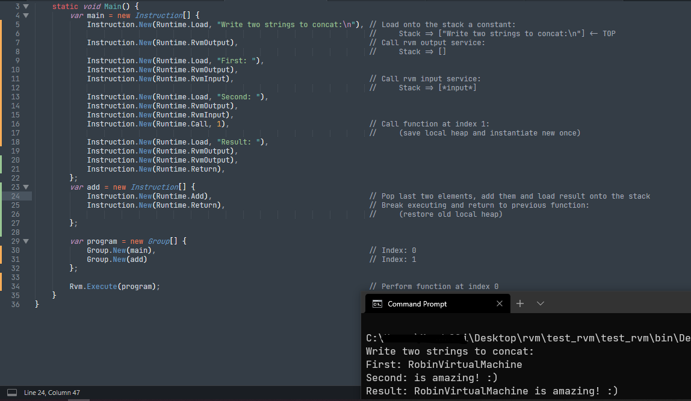

# Robin Virtual Machine 0.9
___________
###### 🟦 RVM is a bytecode simple virtual machine -> provides you tools to make and perform bytecode instructions! 
###### 🟦 RVM is a pointer based vm -> it uses c# delegates (c++ pointers) to performs instructions! 
###### 🟦 RVM is a fast program -> don't worry, c# doesn't make execution, slow! 
###### 🟦 RVM is a experimental and simple product -> it doesn't use switch statement, increasing instructions performing! 
___________
###### ***🟩 That's how bytecode is managed by vm:***
- ___Models___
> - `Group` is a class contains all loaded into vm instructions in a `Instruction` array(Stored in `Models/Label.cs`)
> - `Instruction` is a class contains the delegate to perform and some arguments (Stored in `Models/Instructions.cs`)
- ___Virtual Components___
> - `Storage` is a class, works as a virtual component ex(Virtual Heap) and be initialized in `Runtime` static class at the start of the program with `1000` spaces (Stored in `VirtualComponents/Storage.cs`)
- ___Runtime___
> - `Runtime` is a static class contains all runtime executable instructions, storage initialization and instruction index counter (Stored in `Runtime/Runtime.cs`)
> - `Rvm` is a static class contains main methods to execute labels or main label (at index 0) (Stored in `Runtime/Rvm.cs`)
___________
###### ***🟩 That's how bytecode instructions are performed by vm:***
- `Rvm` contains `ExecuteLabel`, takes `Group` as parameter and with a `for` indexes all instructions contained in an array performing it one by one taking from `Group label.Instructions[InstructionIndex]` delegate to perform and passing to it at the same class location the arguments -> `label.Instructions[InstructionIndex].Instruction(label.Instructions[InstructionIndex].Arguments)`
- `Rvm.ExecuteLabel` besides performs instructions contained in the label passed as parameter, pushes the old storage onto the stack, and instances a new `Storage` into the old to reset it and change its adress to avoid ambiguos behaviours, and restores it once finished reassigning the old value to the new storage variable
___________
###### ***🟩 That's a example:***

___________
