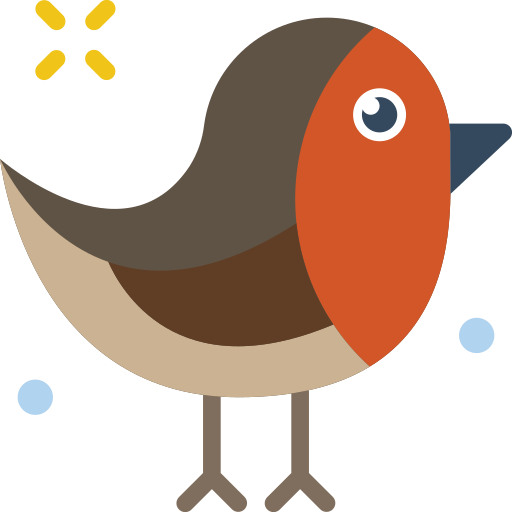

# RobinVM [![Presentation]](https://www.youtube.com/watch?v=kuJoJ9rFCFE&t)
> Robin Virtual Machine
 
 
 
 

<h4>0. RVM is a bytecode virtual machine</h4>
<h4>1. RVM is a pointer based vm</h4>
<h4>2. RVM is a experimental and simple project</h4>
<h4>3. RVM is a object oriented vm</h4>
<h4>4. RVM is a untyped system</h4>
<h4>5. RVM is a modern vm: it supports objects, classes, functions, for iter cycle, exception handling</h4>
<h4>6. RVM is a exensible vm, it can be customized and extended by the user</h4>

